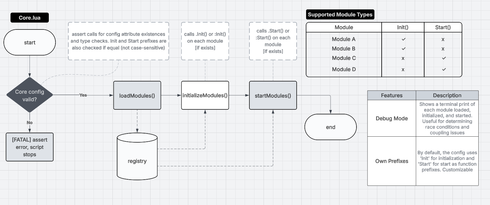

# Relay ServerKit


 
A plug and play mini-framework of independent, drop-in modules for building strict server-authoritative client-server architecture in Roblox game development.
 
---
 
## Installation
 **Required structure in Roblox's Explorer:**
```
game
├── ServerScriptService
│   └── Core.server.lua
├── ServerStorage
│   └── Modules
│       ├── YourModule.lua
│       └── ...
└── ReplicatedStorage
    └── ClientGateway.lua
```
1. Copy the `src/` folder into your project, or sync using [Rojo](https://rojo.space/) with the provided `default.project.json`.
2. Place your game modules inside `ServerStorage.Modules`.
3. Ensure `Core.server.lua` is inside `ServerScriptService` — it bootstraps the entire framework on server start.
 
---
 
## How It Works
 

 
`Core.server.lua` runs once on server startup and drives the full module lifecycle in three sequential phases:
 
**1. Config validation**
Before anything loads, all `CONFIG` fields are asserted for existence and correct type. If any check fails, execution halts immediately with a `[FATAL]` error.
 
**2. `loadModules()`**
Requires all `ModuleScript` instances found in `CONFIG.ModuleDirectory` and registers them into an internal `registry` table.
 
**3. `initializeModules()`**
Iterates over the registry and calls `Init()` (or the configured `InitFuncPrefix`) on each module that defines it. All calls are `pcall`-wrapped.
 
**4. `startModules()`**
Iterates over the registry and calls `Start()` (or the configured `StartFuncPrefix`) on each module that defines it. All calls are `pcall`-wrapped.
 
Both `Init` and `Start` are optional per module — any combination is valid:
 
| Module | Init() | Start() |
|--------|--------|---------|
| Module A | ✓ | ✗ |
| Module B | ✓ | ✗ |
| Module C | ✗ | ✓ |
| Module D | ✗ | ✓ |